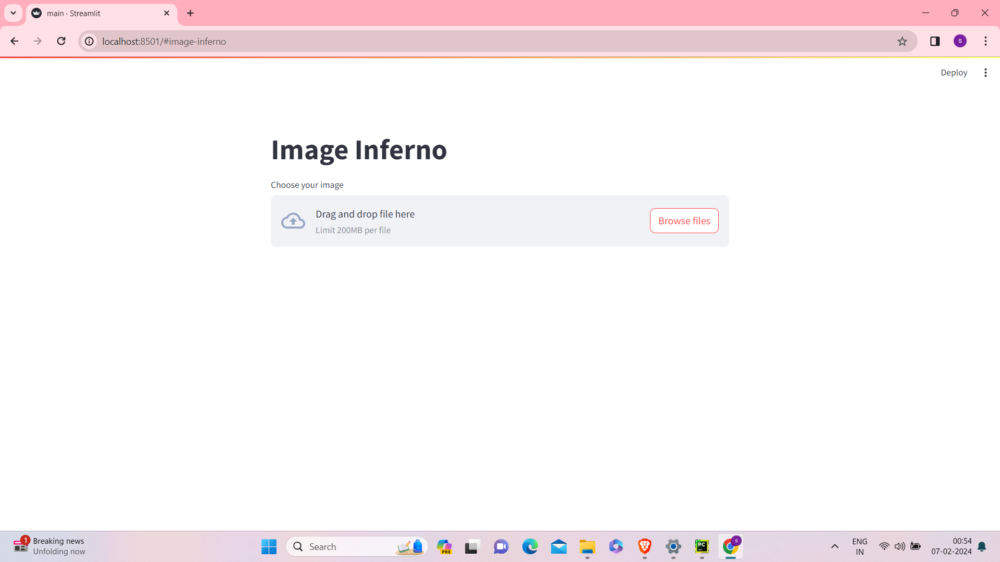
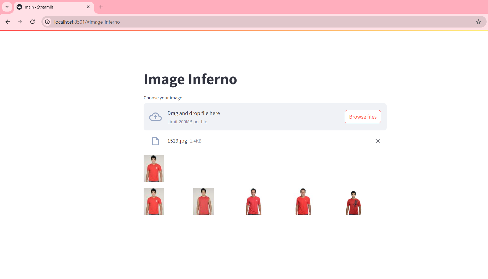
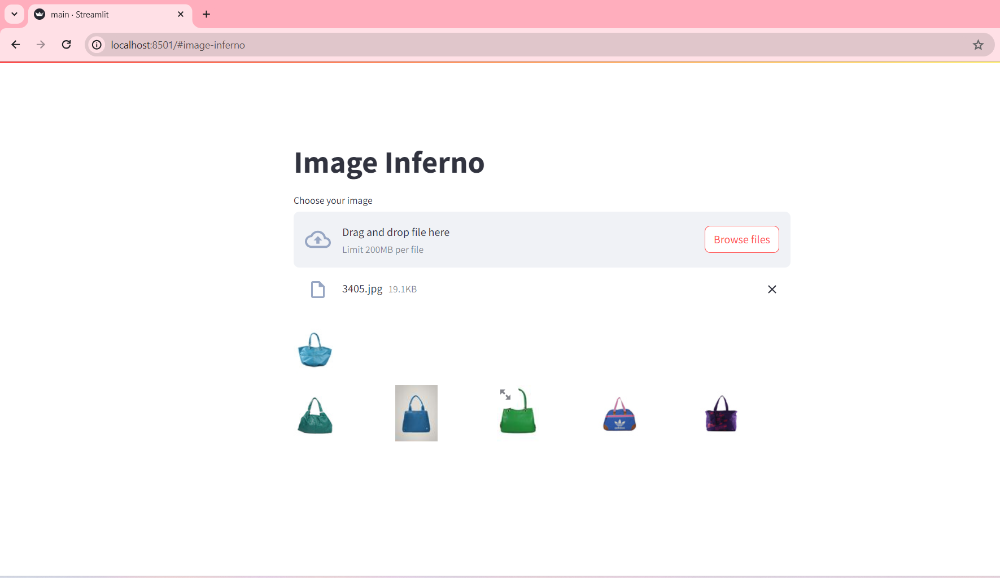

# Deceptive news sequencing using LSTM
ImageInferno is an advanced AI-driven platform that delivers personalized fashion trend recommendations to users based on real-time data analysis and deep learning algorithms. It’s built to provide an engaging user experience through accurate suggestions that align with the latest fashion trends. Using advanced CNN architectures and real-time data processing, ImageInferno delivers recommendations that align with the latest fashion trends and user preferences.

## 📁 Dataset

The dataset for ImageInferno includes a wide range of fashion images categorized by style, brand, and clothing type. This diversity allows the model to learn from a broad spectrum of fashion items, enhancing its recommendation accuracy.

- **Dataset Source**: [Kaggle or Internal Fashion Dataset URL]  
- **Data Size**: ~10,000 images (targeted to 5,000 images for efficiency)  
- **Data Format**: Images labeled with metadata such as category (e.g., tops, bottoms), style (e.g., casual, formal), and brand  


## 📦 Dependencies

Ensure the following dependencies are installed:

1. **TensorFlow**: Deep learning framework
2. **Keras**: Simplifies building neural networks
3. **Scikit-Learn**: For ensemble learning methods and model evaluation
4. **Jupyter Notebook/Google Colab**: Execution and code demonstration platforms
5. **Data Manipulation & Visualization**: Matplotlib, NumPy, Pandas

```bash
pip install tensorflow keras scikit-learn pandas numpy matplotlib seaborn
```
  
## ⚙️ Project Setup and Execution

- **Clone the Repository**: Download or clone this repository to your local system.
    ```bash
    git clone https://github.com/yourusername/ImageInferno.git
    cd ImageInferno
    ```

- **Download the Dataset**:  
  Download the dataset from Kaggle or the specified source.
  
  https://www.kaggle.com/datasets/paramaggarwal/fashion-product-images-dataset

- **Set Up Virtual Environment (Optional)**: It’s recommended to use a virtual environment to manage dependencies.
    ```bash
    python -m venv inferno_env
    source inferno_env/bin/activate  # MacOS/Linux
    inferno_env\Scripts\activate  # Windows
    ```

- **Jupyter Notebook**: If using Jupyter Notebook, start it within the project directory:
    ```bash
    jupyter notebook
    ```

- **Google Colab**: Alternatively, you can upload the code files to Google Colab, where dependencies can be installed directly in Colab’s environment.

## Instructions to Run:

- **Data Preprocessing**: Load and preprocess the data.  
  Execute the Data Collection and Preparation code cells to load images and metadata, clean the data, and resize images.

- **Feature Extraction Using CNN**: Run the feature extraction cells to generate feature vectors for each image.  
  Feature vectors are stored for faster similarity searches.

- **Model Training**:  
  Fine-tune the ResNet50 architecture if necessary and train the model for improved performance. Evaluate the model’s performance using the training and validation metrics.

- **Recommendation Generation**:  
  Use the user-uploaded image to generate recommendations by computing feature similarity with the dataset images.

- **Evaluation**:  
  Run the evaluation cells to generate metrics such as precision, recall, Top-k accuracy, and confusion matrix.

- **Real-Time Recommendation Execution**:  
  Upload an image via the user interface (UI), preprocess it, and run the recommendation process to get fashion suggestions based on the user-uploaded image.

- **Model Saving**:  
  Save the trained model and feature vectors for future use or deployment.

  ### Jupyter Notebook
  Open your terminal and execute the following commands:
  ```bash
  cd ~/Desktop/"Your Project Directory"
  conda activate "Your Environment"
  jupyter notebook
  ```
  ### Google Colab
  Upload the .py or notebook file directly into Google Colab and run the code block by block.
  [Link for Google Colab](https://colab.research.google.com/)
    
## 🧩 Tech Stack

### Frameworks and Libraries:
- **TensorFlow and Keras** for deep learning  
- **Scikit-Learn** for similarity search and evaluation  
- **Pandas and NumPy** for data processing  
- **Matplotlib and Seaborn** for visualization  
- **PIL (Python Imaging Library)** for image manipulation  

### Model Architecture:
- **ResNet50 CNN** for feature extraction  

### Recommendation Algorithm:
- **Nearest Neighbor Search** with Euclidean Distance for similarity scoring  

### Platform:
- **Jupyter Notebook or Google Colab** for training and experimentation  


### 🔍 Step-by-Step Process
Here’s a complete breakdown of the project flow:

### 1. Data Collection and Preparation
- **Dataset Download**: Obtain the fashion dataset from Kaggle or another source.
- **Data Loading**: Use Pandas to read image metadata and PIL for loading image files. This metadata will provide essential information like categories, styles, and brands for model training.
- **Data Cleaning**: Filter out entries with incomplete data, resize images for uniformity (e.g., 224x224 pixels), and normalize pixel values to a standard scale for improved model performance.
- **Dataset Organization**: Split images into separate folders or labels to streamline data processing and improve data retrieval speeds during model training.

### 2. Feature Extraction Using CNN
- **ResNet50 Architecture**: Load the ResNet50 model pre-trained on ImageNet. ResNet50’s deep layers allow it to capture intricate patterns and textures in fashion images.
- **Feature Vectorization**: Pass each image through ResNet50’s convolutional layers, using the final fully connected layer output as a dense feature vector representation.
- **Storage Optimization**: Store the extracted feature vectors in a structured format (e.g., NumPy arrays or HDF5 format) for rapid similarity comparison during the recommendation process.

### 3. Similarity Matching and Recommendations
- **Similarity Search Setup**: Apply the Nearest Neighbor Search (e.g., using Scikit-Learn's `NearestNeighbors` function) to compare feature vectors based on Euclidean distance. The model computes similarity between the uploaded image and images in the dataset.
- **Recommendation Generation**: For a given user-uploaded image, identify the top-N (e.g., top-5) fashion items with the smallest Euclidean distance, which suggests a high degree of similarity.
- **Ranking Recommendations**: Rank and display the recommended items to users, starting with those with the highest similarity score.

### 4. Model Training and Evaluation
- **Data Splitting**: Divide the dataset into training and testing sets, ensuring a balance across fashion categories for more accurate model evaluation.
- **Model Fine-Tuning**: Fine-tune ResNet50 on the fashion dataset if necessary, using a custom final layer specific to fashion categories (e.g., tops, pants, dresses).
- **Evaluation Metrics**: Use precision, recall, Top-k accuracy, mAP (Mean Average Precision), and confusion matrices to measure the model’s recommendation performance.

### 5. User Upload and Real-Time Prediction
- **User Interface for Image Upload**: Design a simple user interface where users can upload images of their choice.
- **Image Preprocessing**: Upon upload, resize and normalize the image to match the model’s input dimensions, ensuring compatibility with the ResNet50 feature extractor.
- **Prediction Workflow**: Extract features from the uploaded image, compare them with dataset feature vectors, and retrieve similar fashion items for recommendation.

### 6. Results and Visualization
- **Top-k Recommendations Display**: For each user-uploaded image, display the top-N recommended items in a visually appealing format, allowing users to compare their upload with the system’s recommendations.
- **Evaluation Summary**: Summarize metrics such as accuracy, precision, recall, and F1-score. Display a confusion matrix and Top-k accuracy graph to visualize performance.
- **Training vs. Validation Plots**: Use Matplotlib to plot training vs. validation accuracy and loss over epochs, providing insight into model convergence and overfitting.

### 7. Deployment and Testing
- **Model Saving**: Export the trained model and feature vectors to files (.h5 for the model and .npy or .hdf5 for feature vectors).
- **API or Interface Development**: Deploy the model with an API (e.g., Flask or FastAPI) that can handle real-time requests for image-based recommendations.
- **Testing in Real Scenarios**: Test the deployed model with diverse user-uploaded images to ensure the system accurately recommends relevant fashion items.
- 

### 📊 Results and Evaluation Metrics
The model’s performance is evaluated on the following metrics:
- **Confusion Matrix**: To see accurate vs. inaccurate predictions.
- **Precision and Recall**: To assess true positive recommendations.
- **Top-k Accuracy**: Measures the accuracy of the top-k recommendations.
- **mAP (Mean Average Precision)**: To evaluate the ranking of recommended items.

## Example Output




## 📜 License
[MIT](https://choosealicense.com/licenses/mit/)

## 🤖 About Me :
I'm Srijayanth Potluri, an aspiring data analyst with expertise in ML, DL, and NLP technologies, dedicated to developing advanced recommendation systems for personalized user experiences.

## 🔗 Links
[](https://www.linkedin.com/in/srijayanth-potluri-437519259/)
[](https://twitter.com/SrijayanthP)

